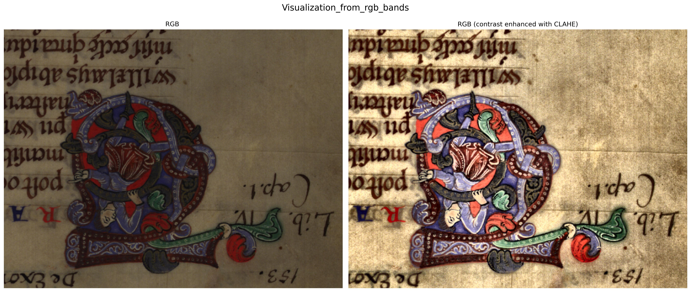
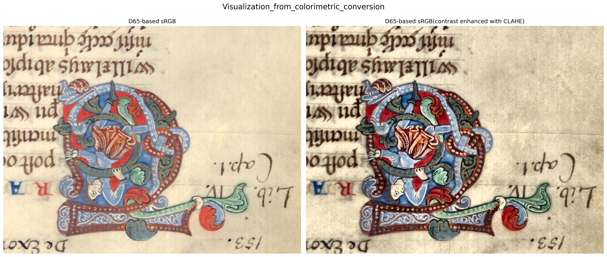
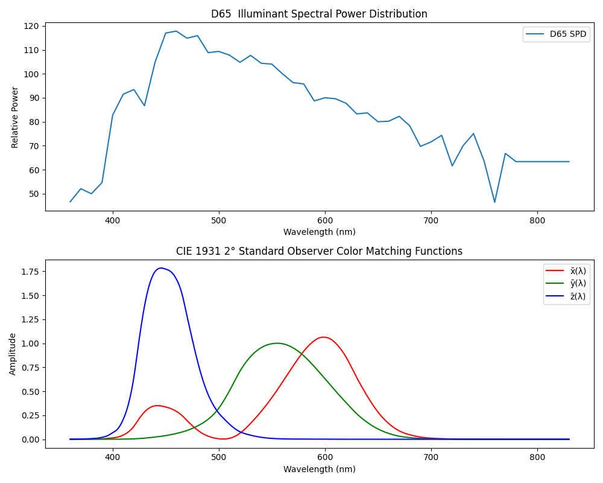

# TrueColorHSI
## Overview
TrueColorHSI is a Python toolkit that turns hyperspectral images into color visuals that reflect how we truly see the world. Unlike traditional methods that rely on a few chosen bands, it uses colorimetric science, standard illuminants, and standard observers to integrate over the whole visible spectrum. It generates vivid, accurate images that help users better understand and explore the input hyperspectral data.


## Setup Instructions

```bash
# Clone the repo and cd to the folder.
git clone https://github.com/fz-rit/TrueColorHSI.git
cd TrueColorHSI

# Create a new conda environment with Python 3.9 (not the latest python), 
# since it's relatively more compatible to different packages as of 11/14/2024.
conda create -n truecolorhsi_env python=3.9
conda activate truecolorhsi_env

# Install the dependencies with pip
pip install spectral matplotlib scipy scikit-image pysptools
pip install colour-science
pip install huggingface_hub

# [Optional] If you want to download the test dataset. Login to huggingface
huggingface-cli login # To login, create and add your token according to the guide
```

---
## Files description
| File/Folder                         | Description |
|-------------------------------------|-------------|
| `Accessories_from_colour.py`        | Tool function of getting the spectral power distribution of illuminant. |
| `true_color_of_hyperspectral_image.py`           | The true color visualization script. |

---

## Usage
1) Clone the repo and setup the environment;
2) [Optional: if you want to run the test dataset] Clone the test dataset to a specific folder:
```bash
git clone fz-rit-hf/rit-cis-hyperspectral-Symeon # you may need to request for access. 
```
3) Adjust the input paths in lines 220-222 in the [true_color_of_hyperspectral_image.py](true_color_of_hyperspectral_image.py) file. Then run the script: 
```bash 
python true_color_of_hyperspectral_image.py
```

## Example results

*Figure 1. Visualization from appximated RGB bands (traditional method).*


*Figure 2. Visualization from colorimetric conversion (our method).*


*Figure 3. True color visualization using different standard illuminants (D50, D65, D75). Adjusting the chosen illuminant allows for tuning the color temperature.*

  
*Figure 4. The spectral power distribution of the D65 illuminant and the CIE xyz curves.*


## Citation
If you find this repository useful in your research, please consider the following citation.
```bib
@article{amiri2024colorimetric,
  title={Colorimetric characterization of multispectral imaging systems for visualization of historical artifacts},
  author={Amiri, Morteza Maali and Messinger, David W and Hanneken, Todd R},
  journal={Journal of Cultural Heritage},
  volume={68},
  pages={136--148},
  year={2024},
  publisher={Elsevier}
}
```
