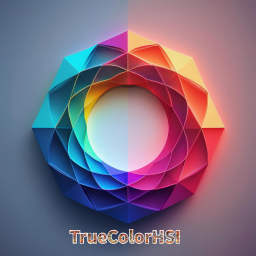
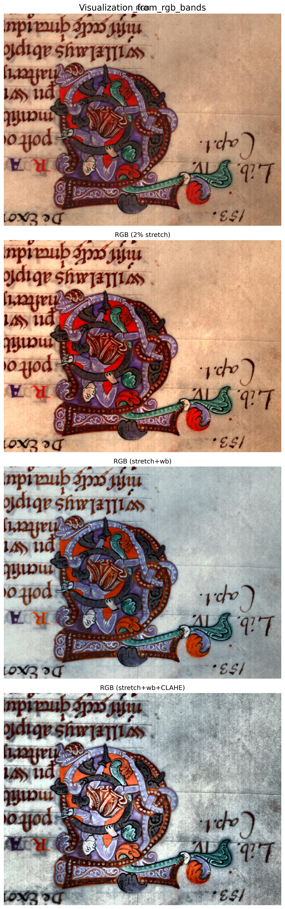
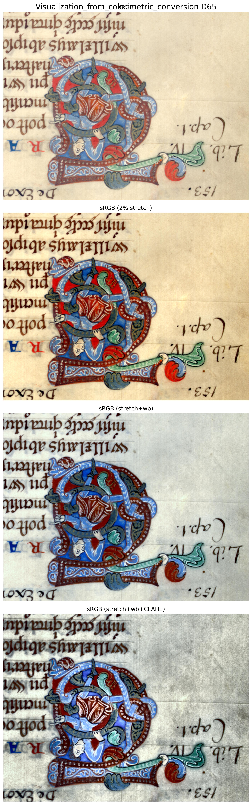
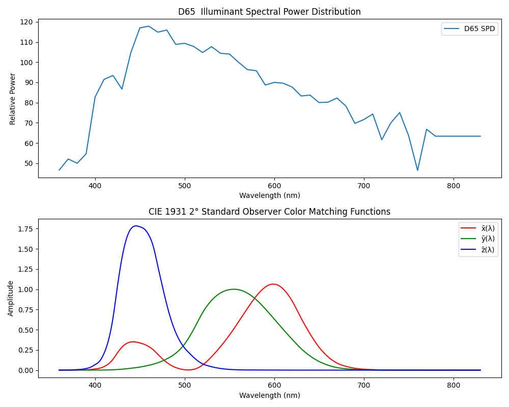

# TrueColorHSI 
## Overview

Traditional hyperspectral visualization methods convert images to RGB by averaging bands into fixed ranges corresponding to blue, green, and red. While practical, this method oversimplifies the data and may result in a loss of important details and nuances.

**TrueColorHSI** takes a more sophisticated approach by using colorimetric science to process the entire visible spectrum, delivering vivid, perceptually accurate images. Additionally, it offers users the flexibility to adjust the illuminant (D50, D55, D65, D75), enhancing the interpretation of hyperspectral data under different lighting conditions. The package also provides image enhancement tools such as white balance and contrast adjustment to further refine the visualization.


| **Aspect**              | **Traditional Method**                                              | **✨ TrueColorHSI ✨**                                              |
|-------------------------|---------------------------------------------------------------------|--------------------------------------------------------------------|
| **Spectral Band Usage**  | ⚙️ Fixed RGB ranges (Blue, Green, Red)                              | 🌈 **Full visible spectrum utilization**                           |
| **Color Basis**          | ⚙️ Based on peak wavelengths (~470, ~545, ~680 nm)                 | 🌈 **Colorimetric science-based**                                  |
| **Color Accuracy**       | ⚠️ Approximate color reproduction                                   | ✅ **Highly accurate color representation**                         |
| **Visualization Quality**| ⚠️ Simplified, may lose details                                    | ✅ **Vivid and detailed output**                                    |
| **User Experience**      | ⚙️ Limited user control                                            | ✅ **Tunable illuminants (D50, D55, D65, D75)**                    |

---

Note: The input data need to cover the full visible spectrum (400-700 nm) to achieve the best results. If the data is not full-spectrum, the package will still work, but the output may not be as accurate.


## Installation:
You can install `TrueColorHSI` via `pip`:
```bash
pip install TrueColorHSI
```

## Usage:


```python
from truecolorhsi.visualization import vanilla_visualization, colorimetric_visualization
from pathlib import Path
input_path = Path("path/to/the/input/file")
vanilla_display_images = vanilla_visualization(input_path, visualize=True, saveimages=True)
colorimetric_display_images = colorimetric_visualization(input_path, visualize=True, saveimages=True)
```
Supportted data format:
- [Symeon-Cultural-Heritage](https://huggingface.co/datasets/fz-rit-hf/rit-cis-hyperspectral-Symeon) ENVI HSI data, which comes with a `.hdr` file along with the data file (prefered)
- [Heidelberg Porcine HyperSPECTRAL Imaging Dataset](https://heiporspectral.org/) - a binary file ends with `.dat`
  - For more details about tests, checkout the note book [test_visualization_bio.ipynb](notebooks/test_visualization_bio.ipynb)

### Parameters for `vanilla_visualization`:
- `input_path` (Union[str, Path]): The path to the input file containing the hyperspectral imaging data.
- `visualize` (bool, default=False): If set to True, the function will display the images.
- `stretch_percent` (int, default=2): The percentage of histogram stretching to apply for contrast enhancement.
- `wb_method` (str, default='ml_wb'): The white balance method to use. Options include 'ml_wb' , 'gray_wb', and 'white patch'.
- `saveimages` (bool, default=False): If set to True, the function will save the images to disk.
- `savefolder` (Optional[Path], default=None): The folder where the images will be saved. If None, images will be saved in the current directory.

### Parameters for `colorimetric_visualization`:
- `input_path` (Union[str, Path]): The path to the input file containing the hyperspectral imaging data.
- `illuminant` (str, default='D65'): The illuminant to use for colorimetric conversion. Options include 'D65', 'A', 'F2', etc.
- `stretch_percent` (int, default=2): The percentage of histogram stretching to apply for contrast enhancement.
- `wb_method` (str, default='ml_wb'): The white balance method to use. Options include 'ml_wb' (machine learning based), 'gray_wb' (Gray World), and 'white_patch' (White patch assisted with blob detection).
- `visualize` (bool, default=False): If set to True, the function will display the images.
- `saveimages` (bool, default=False): If set to True, the function will save the images to disk.
- `savefolder` (Optional[Path], default=None): The folder where the images will be saved. If None, images will be saved in the current directory.


## Example results
<p align="center">
  
  
</p>
<p align="center">
  <em>Figure 1. Visualization from approximated RGB bands (traditional method) on the left. Figure 2. Visualization from colorimetric conversion (our method) on the right.</em>
</p>


*Figure 3. True color visualization using different standard illuminants (D50, D65, D75) (white balance not applied). Adjusting the chosen illuminant allows for tuning the color temperature.*

  
*Figure 4. The spectral power distribution of the D65 illuminant and the CIE xyz curves.*


## Citation
If you find this repository useful in your research, please consider the following citation.
```bib
@misc{TrueColorHSI,
  author = {Fei Zhang},
  title = {TrueColorHSI},
  year = {2025},
  howpublished = {\url{https://github.com/fz-rit/TrueColorHSI}},
  note = {Accessed: 2025-02-08}
}

@article{amiri2024colorimetric,
  title={Colorimetric characterization of multispectral imaging systems for visualization of historical artifacts},
  author={Amiri, Morteza Maali and Messinger, David W and Hanneken, Todd R},
  journal={Journal of Cultural Heritage},
  volume={68},
  pages={136--148},
  year={2024},
  publisher={Elsevier}
}
```
